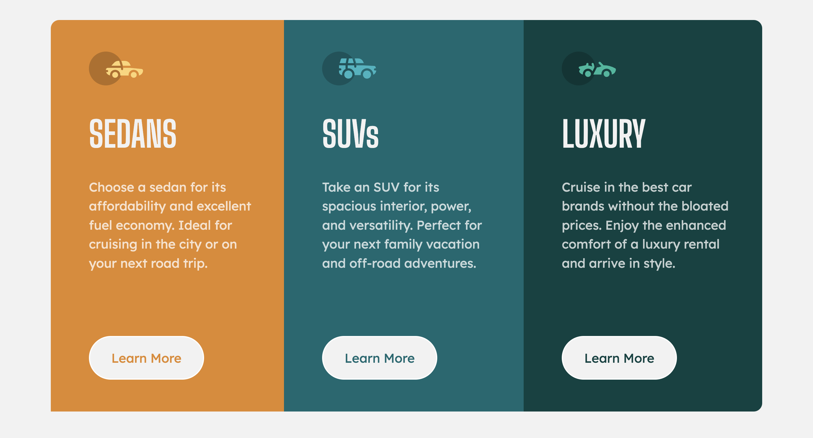

# Frontend Mentor - 3-column preview card component solution

This is a solution to the [3-column preview card component challenge on Frontend Mentor](https://www.frontendmentor.io/challenges/3column-preview-card-component-pH92eAR2-). Frontend Mentor challenges help you improve your coding skills by building realistic projects.

## Table of contents

- [Overview](#overview)
  - [The challenge](#the-challenge)
  - [Screenshot](#screenshot)
  - [Links](#links)
- [Author](#author)

## Overview

Noticed that I never finished this project so I decided to takle it today. any and all suggestions welcome!

### The challenge

Users should be able to:

- View the optimal layout depending on their device's screen size
- See hover states for interactive elements

### Screenshot

### Links

- Live Site URL: [3-Column-Preview-Card](https://hazel-black.github.io/3-Column-Preview-Card/)

## Author

- Youtube - [HazelBDev](https://www.your-site.com)
- Frontend Mentor - [@Hazel-Black](https://www.frontendmentor.io/profile/hazel-black)
